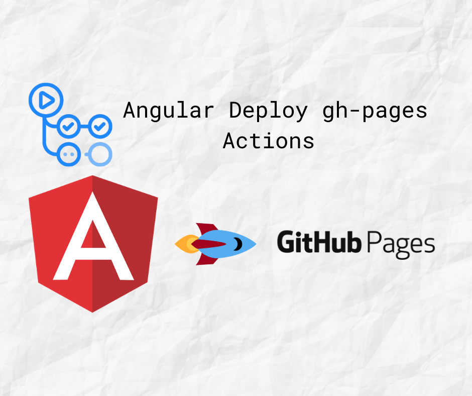

# :rocket: Angular Deploy gh-pages Actions

 [](https://github.com/marketplace/actions/angular-deploy-gh-pages-actions/) [](https://github.com/AhsanAyaz/angular-deploy-gh-pages-actions/releases)

This [GitHub action](https://github.com/features/actions) will handle the deploy process of your angular application to [GitHub Pages](https://pages.github.com/). You can configure what folder will be deployed once the build is created. Also, you can specify which branch to deploy to.



## Getting Started :muscle:

You can include the action in your workflow to trigger on any event that [GitHub actions supports](https://help.github.com/en/articles/events-that-trigger-workflows). If the remote branch that you wish to deploy to doesn't already exist the action will create it for you. Your workflow will also need to include the `actions/checkout` step before this workflow runs in order for the deployment to work.

You can view an example of this below.

```yml
name: Build and Deploy
on:
  push:
    branches:
      - master
jobs:
  build:

    runs-on: ubuntu-latest

    steps:
    - uses: actions/checkout@v2
    - name: All things angular
      uses: AhsanAyaz/angular-deploy-gh-pages-actions@[version] ## replace by latest version without it you will see Expected format {org}/{repo}[/path]@ref. Actual 'AhsanAyaz/angular-deploy-gh-pages-actions',Input string was not in a correct format.
      with:
        github_access_token: ${{ secrets.ACCESS_TOKEN }} # see the Configuration section for how you can create secrets
        build_configuration: staging # The build environment for the app. please look configurations in your angular.json
        base_href: /my-project/   # make sure this corresponds to https://<your_username>.github.io/<base_href>/
        deploy_branch: gh-pages # The branch the action should deploy to.
        angular_dist_build_folder: dist/my-project # The folder where your project is supposed to be after running ng build by the action.
```

If you'd like to make it so the workflow only triggers on push events to specific branches then you can modify the `on` section.


## Configuration ⚙️

You have to configure the `with` portion of your workflow file so that the action works fine. See the usage of `with` in the example above. Fir the Github secret (ACCESS_TOKEN) or anything added later, `secrets` must be referenced using the bracket syntax and stored in the GitHub repositories `Settings/Secrets` menu. You can learn more about setting environment variables with GitHub actions [here](https://help.github.com/en/articles/workflow-syntax-for-github-actions#jobsjob_idstepsenv).

| Key            | Value Information                                                                                                                                                                                                                                                                                                                                                                                                                                              | Type             | Required | Default |
| -------------- | -------------------------------------------------------------------------------------------------------------------------------------------------------------------------------------------------------------------------------------------------------------------------------------------------------------------------------------------------------------------------------------------------------------------------------------------------------------- | ---------------- | -------- | -------- |
| `angular_project_dir`          | The directory of the angular project, in which all the commands will run. This is super handy when you have several projects within a workspace. Or have a demo angular project within a library. Defaults to current workspace directory                                                                                                                                                            | `with`           | **Yes**  |  "./"  |
| `build_configuration`          | You can provide the configuration using which the action should create the build. If nothing is provided, it will run `ng build --prod` by default. See your angular.json file for configurations.                                                                                                                                                            | `with`           | **Yes**  |  "production"  |
| `base_href`          | Since gh-pages will deploy the app for https://yourgithubusername.github.io/repositoryname/, you need to provide this `base-href` in order to have your project working correctly, since the base-href won't be `'/'` in this case. Note to use with `@angular/cli@^10.0.0` (Angular version 10), you need the specify the base-href in the angular.json file and then use an empty string as parameter `base_href: '' # empty string to support optional base-href` to make the parameter optional.                                                                                                                                                            | `with`           | **No**  | "/" |
| `deploy_branch`          | The branch to which we'll deploy the build folder.                                                                                                                                                            | `with`           | **No**  | "gh-pages" |
| `angular_dist_build_folder`          | The folder in which `ng build` provides its output for your project. The folder where your index.html resides in. Also, this is the folder which will be deployed to the `deploy_branch`.                                                                                                                                                             | `with`           | **No**  | "dist" |
| `run_lint`          | Runs the `ng lint` command behind the scenes to make sure the files are linted properly.                                                                                                                                                             | `with`           | **No**  | "false" |
| `github_access_token` | Depending on the repository permissions you may need to provide the action with a GitHub personal access token instead of the provided GitHub token in order to deploy. You can [learn more about how to generate one here](https://help.github.com/en/articles/creating-a-personal-access-token-for-the-command-line). **This should be stored as a secret**.                                                                                                 | `secrets / with` | **Yes**  |

## Contributing :person:

Install the dependencies
```bash
$ npm install
```

Build the typescript and package it for distribution
```bash
$ npm run build && npm run pack
```

Run the tests :heavy_check_mark:
```bash
$ npm test
  PASS  __tests__/main.test.ts
    ✓ test does not run lint if run_lint is falsy (3ms)
    ✓ test runs lint if run_lint is not falsy (1ms)
    ✓ test throws error for deployment if accessToken is not provided (17ms)
    ✓ test runs fine for deployment if all inputs are correct (1ms)
    ✓ test runs createBuild with provided values  (1ms)
    ✓ test runs createBuild with default values if they are not explicitly provided

...
```


See the [versioning documentation](https://github.com/actions/toolkit/blob/master/docs/action-versioning.md)

## LICENSE 📋
[Licensed under the MIT License (the "License")](./LICENSE);
